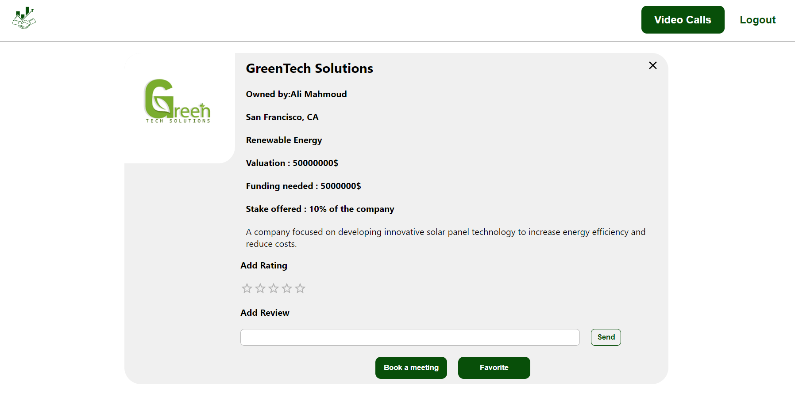
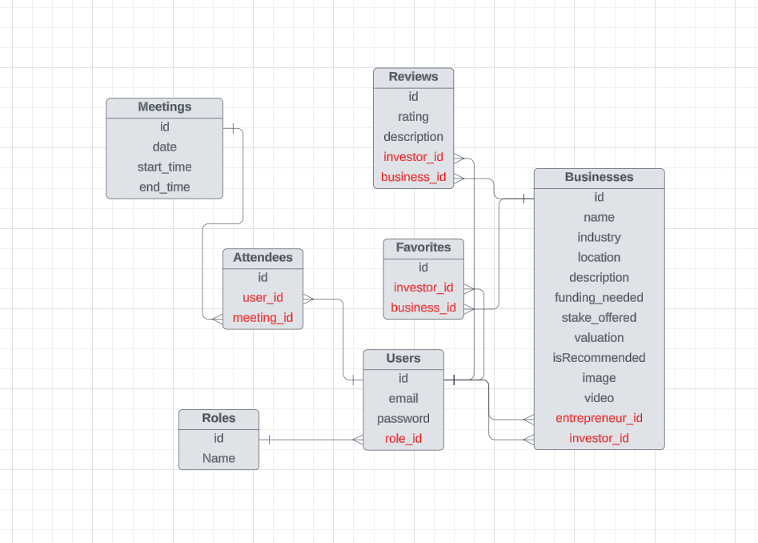
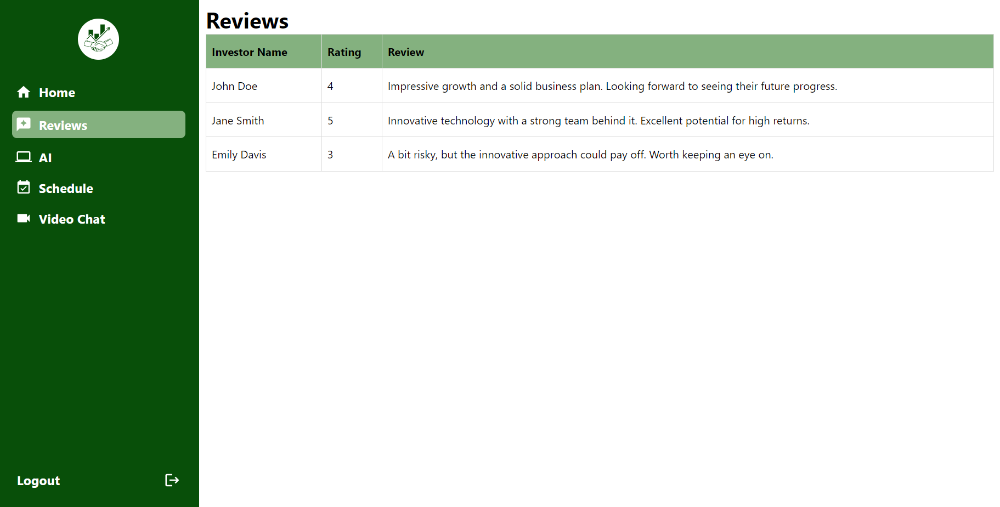
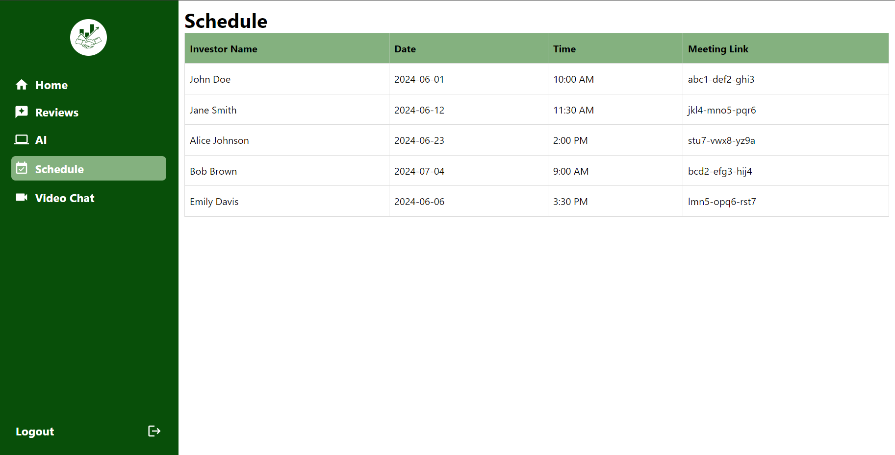
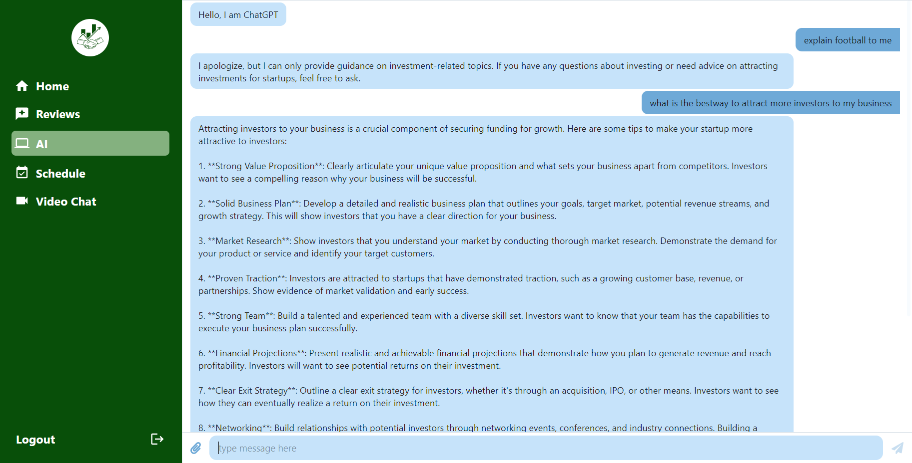
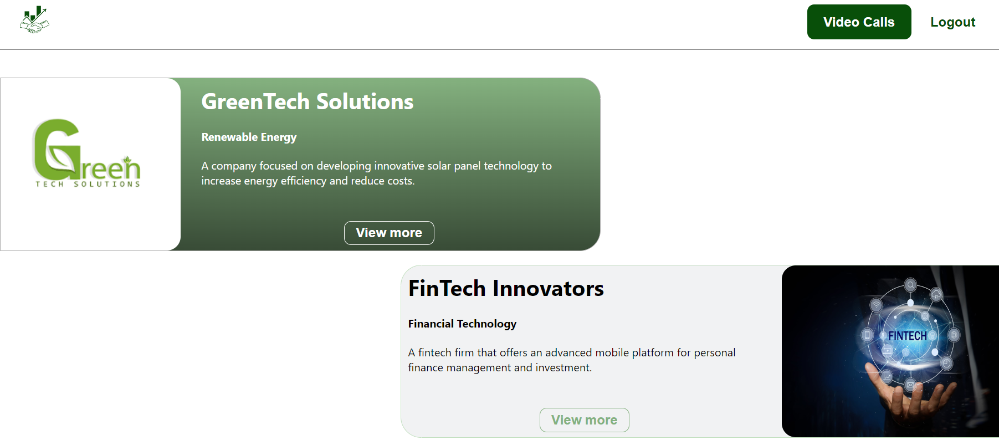
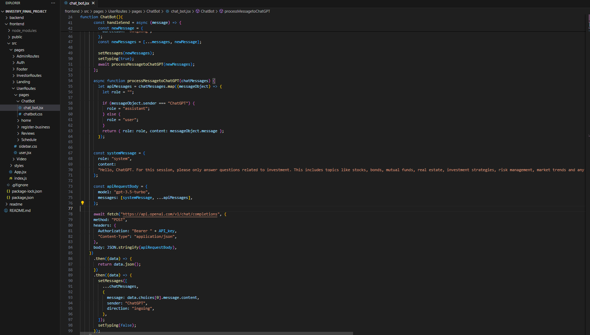
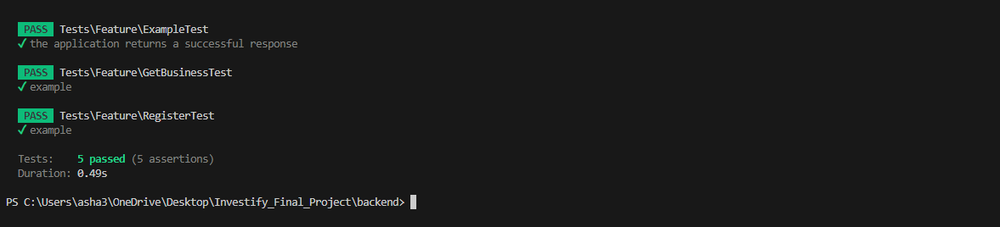

<br><br>

<!-- project philosophy -->


> A website to stimulate innovation and drive economic growth by connecting investors with promising startups, facilitating meaningful partnerships. 
>
> Investify aims to connect investors with entrepreneur ideas or startups by providing a user-friendly platform for users to connect and negotiate a deal.

### User Stories
### Investor
- As an investor, I want to browse through a variety of investment opportunities across different industries, so i can choose the best business to invest in.
- As an investor, I want to access AI, so i can make informed investment decisions and stay updated on market trends.
- As an investor, I want to schedule and manage online meetings with entrepreneurs, so i can negotiate and discuss offers.

### Entrepreneur
- As an entrepreneur, I want to create a detailed profile for my business, including information about business and fundings needed, so i can find the best investment.
- As an entrepreneur, I want to seek AI help, so I can elevate my startup.
- As an entrepreneur, I want to receive feedback and guidance from experienced investors, so i can improve my pitch and increase my chances of securing fundings.

### Admin
- As an admin, I want to be able to invite investors using emails, so i can expand our network of investors.
- As an admin, I want to see analytics, so i can have an overveiw on the website.

<br><br>
<!-- Tech stack -->


###  Investify is built using the following technologies:

- This project uses [Laravel](https://laravel.com) framework for backend, Laravel serves as a backend framework for PHP web development, offering features and tools that streamline backend processes, such as routing, database management, authentication, and API development, empowering developers to build robust and scalable server-side applications efficiently.
- Our website uses [VideoSDK](https://www.videosdk.live/) to connect users via video chat. This integration allows negotiation and discussion between them.
- This project uses [React](https://react.dev/) as a frontend JavaScript library.
- Our project features a chatbot powered by [OpenAI's](https://openai.com/) GPT-3.5-turbo model. This integration enhances user interaction by leveraging advanced natural language processing capabilities to answer questions specifically about investments.

<br><br>
<!-- UI UX -->


> We designed Investify using wireframes and mockups, iterating on the design until we reached the ideal layout for easy navigation and a seamless user experience.

- Project Figma design [figma](https://www.figma.com/design/xCdCTGsLS8Xi0SkYZSWOZI/Readme-Template-Assets?node-id=0-1&t=0S1yLdwPdz281ZP7-0)


### Mockups
| Login screen  | Entrepreneur Home Screen | Investor View Business Screen |
| ---| ---| ---|
|  |  |  |

<br><br>

<!-- Database Design -->


###  Architecting Data Excellence: Innovative Database Design Strategies:

- Insert ER Diagram here


<br><br>


<!-- Implementation -->


### Entreprneur Screens (Web)
| Login screen  | Register screen |  Landing screen |
| ---| ---| ---|
|  |  |  |
| Review screen  | Schedule Screen | Chatbot Screen |
|  |  |  |

### Investor Screens (Web)
| Register screen  | Landing screen |  View Business screen |
| ---| ---| ---|
|  |  |  |

<br><br>


<!-- Prompt Engineering -->


###  Mastering AI Interaction: Unveiling the Power of Prompt Engineering:

- This project has a chatbot designed to deliver precise and pertinent responses on investments, utilizing the OpenAI GPT-3.5-turbo model. To achieve this, we guide the model to focus solely on investment-related inquiries.


<br><br>

<!-- AWS Deployment -->


###  Efficient AI Deployment: Unleashing the Potential with AWS Integration:

- 

<br><br>

<!-- Unit Testing -->


###  Precision in Development: Harnessing the Power of Unit Testing:


- 

<br><br>


<!-- How to run -->


### Prerequisites

Make sure you have the following prerequisites installed on your system:
1. Insatall [Composer](https://getcomposer.org/download/)
2. Install [Node-and-NPM](https://nodejs.org/en/download/package-manager)

### Installation

Below are the steps to run Investify

1. Clone the repo
      ```sh
   git clone https://github.com/Ashraf-Sharaf/Investify.git
   ```
2. Navigate to frontend directory
   ```sh
   cd frontend
   ```
3. Install npm packages
      ```sh
   npm install
   ```
4. Navigate to backend directory
   ```sh
   cd ..
   cd backend
   ```
5. Install composer packages
      ```sh
   composer install
   ```

Now, you should be able to run Investify locally.