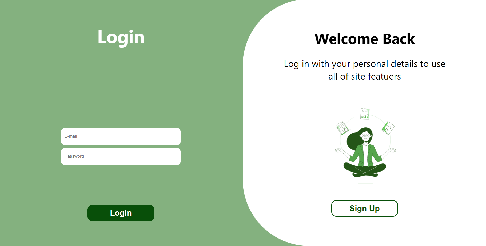
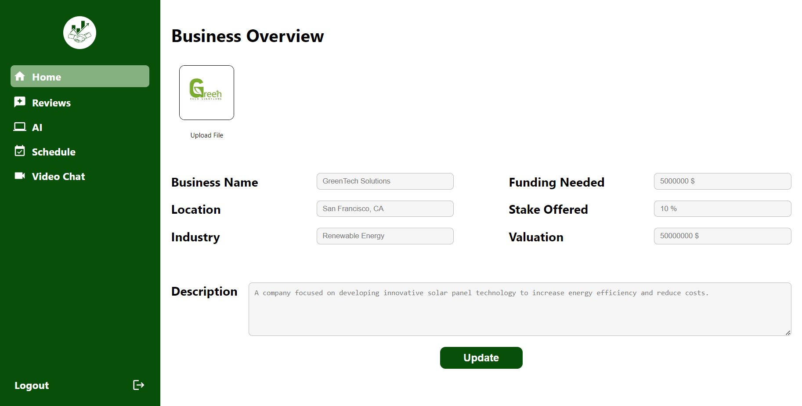

<br><br>

<!-- project philosophy -->


> A website to stimulate innovation and drive economic growth by connecting investors with promising startups, facilitating meaningful partnerships. 
>
> Investify aims to connect investors with entrepreneur ideas or startups by providing a user-friendly platform for users to connect and negotiate a deal.

### User Stories
### Investor
- As an investor, I want to browse through a variety of investment opportunities across different industries, so i can choose the best business to invest in.
- As an investor, I want to access AI, so i can make informed investment decisions and stay updated on market trends.
- As an investor, I want to schedule and manage online meetings with entrepreneurs, so i can negotiate and discuss offers.

### Entrepreneur
- As an entrepreneur, I want to create a detailed profile for my business, including information about business and fundings needed, so i can find the best investment.
- As an entrepreneur, I want to seek AI help, so I can elevate my startup.
- As an entrepreneur, I want to receive feedback and guidance from experienced investors, so i can improve my pitch and increase my chances of securing fundings.

### Admin
- As an admin, I want to be able to invite investors using emails, so i can expand our network of investors.
- As an admin, I want to see analytics, so i can have an overveiw on the website.

<br><br>
<!-- Tech stack -->


###  Investify is built using the following technologies:

- This project uses [Laravel](https://laravel.com) framework for backend, Laravel serves as a backend framework for PHP web development, offering features and tools that streamline backend processes, such as routing, database management, authentication, and API development, empowering developers to build robust and scalable server-side applications efficiently.
- Our website uses [VideoSDK](https://www.videosdk.live/) to connect users via video chat. This integration allows negotiation and discussion between them.
- This project uses [React](https://react.dev/) as a frontend JavaScript library.
- Our project features a chatbot powered by [OpenAI's](https://openai.com/) GPT-3.5-turbo model. This integration enhances user interaction by leveraging advanced natural language processing capabilities to answer questions specifically about investments.

<br><br>
<!-- UI UX -->


> We designed Investify using wireframes and mockups, iterating on the design until we reached the ideal layout for easy navigation and a seamless user experience.

- Project Figma design [figma](https://www.figma.com/design/xCdCTGsLS8Xi0SkYZSWOZI/Readme-Template-Assets?node-id=0-1&t=0S1yLdwPdz281ZP7-0)


### Mockups
| Login screen  | Menu Screen | Order Screen |
| ---| ---| ---|
|  |  |  |

<br><br>

<!-- Database Design -->


###  Architecting Data Excellence: Innovative Database Design Strategies:

- Insert ER Diagram here


<br><br>


<!-- Implementation -->


### User Screens (Mobile)
| Login screen  | Register screen | Landing screen | Loading screen |
| ---| ---| ---| ---|
|  |  |  |  |
| Home screen  | Menu Screen | Order Screen | Checkout Screen |
|  |  |  |  |

### Admin Screens (Web)
| Login screen  | Register screen |  Landing screen |
| ---| ---| ---|
|  |  |  |
| Home screen  | Menu Screen | Order Screen |
|  |  |  |

<br><br>


<!-- Prompt Engineering -->


###  Mastering AI Interaction: Unveiling the Power of Prompt Engineering:

- This project uses advanced prompt engineering techniques to optimize the interaction with natural language processing models. By skillfully crafting input instructions, we tailor the behavior of the models to achieve precise and efficient language understanding and generation for various tasks and preferences.

<br><br>

<!-- AWS Deployment -->


###  Efficient AI Deployment: Unleashing the Potential with AWS Integration:

- This project leverages AWS deployment strategies to seamlessly integrate and deploy natural language processing models. With a focus on scalability, reliability, and performance, we ensure that AI applications powered by these models deliver robust and responsive solutions for diverse use cases.

<br><br>

<!-- Unit Testing -->


###  Precision in Development: Harnessing the Power of Unit Testing:

- This project employs rigorous unit testing methodologies to ensure the reliability and accuracy of code components. By systematically evaluating individual units of the software, we guarantee a robust foundation, identifying and addressing potential issues early in the development process.

<br><br>


<!-- How to run -->


> To set up Coffee Express locally, follow these steps:

### Prerequisites

This is an example of how to list things you need to use the software and how to install them.
* npm
  ```sh
  npm install npm@latest -g
  ```

### Installation

_Below is an example of how you can instruct your audience on installing and setting up your app. This template doesn't rely on any external dependencies or services._

1. Get a free API Key at [example](https://example.com)
2. Clone the repo
   git clone [github](https://github.com/your_username_/Project-Name.git)
3. Install NPM packages
   ```sh
   npm install
   ```
4. Enter your API in `config.js`
   ```js
   const API_KEY = 'ENTER YOUR API';
   ```

Now, you should be able to run Coffee Express locally and explore its features.